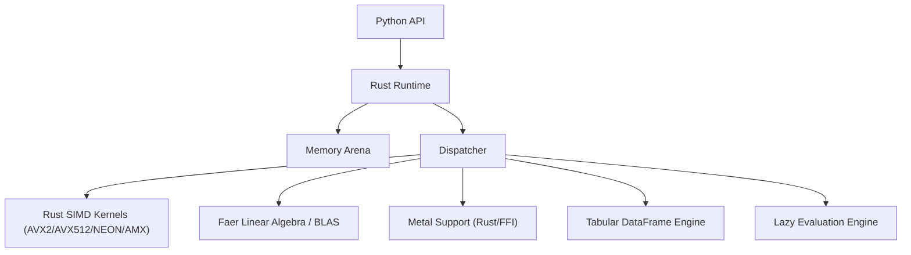

# Architecture

Corepy is built as a layered system to maximize performance while retaining Pythonic usability.

## The Stack

### 1. Python Layer (`corepy/`)
- **Duty**: Exposes the user-facing API (`ndarray`, `DataFrame`, `lazy`, `random`, `profiler`).
- **State**: Holds references to underlying Rust `CoreArray` objects.
- **Overhead**: Minimal. Most operations immediately drop into Rust.

### 2. Rust Runtime (`rust/core/`)
- **Duty**: The "Brain" and "Muscle" of the operation.
- **Backend Dispatch**: Intelligent enough to dynamically detect CPU flags (AVX2, AVX512, NEON, SVE, AMX) and Route to the most performant path.
- **Cache-Aware Tiling**: Reads L1/L2/L3 cache sizes directly from the OS to automatically tile and block matrix operations.
- **Safety**: Uses Rust's borrow checker to ensure threads don't race on memory.
- **Parallelism**: Uses `rayon` to parallelize operations over large arrays (automatically triggers for large workloads).
- **UFunc System**: Element-wise universal functions using native Rayon mapping loops.
- **DataFrame Engine**: High-performance columnar database architecture supporting `read_csv`, `groupby`, and `merge` with zero-copy operations.
- **Lazy Evaluation**: Capable of building expression trees and fusing multiple operations into single optimized kernels to save memory bandwidth.
- **Robust PRNG**: Rayon-parallelized, multi-threaded random number generation using PCG64 and Xoshiro algorithms.

## Dispatch Mechanism

When you call `array.sum()`, the following happens:

1.  **Python**: `Array.sum()` calls `corepy._corepy_rust.array_sum_f32`.
2.  **Rust**:
    -   Receives the pointer to the data via PyO3.
    -   Checks size and hardware capabilities (AVX2, NEON).
    -   If size < Threshold: Runs purely on the calling thread using optimized SIMD.
    -   If size > Threshold: Splits the data into chunks and uses `rayon` to process them in parallel.
3.  **Kernel**: Each thread executes a tight Rust loop that is vectorized by the compiler or uses target-specific intrinsics.
4.  **Result**: Aggregated back in Rust and returned to Python.

## Memory Management

- **Initialization**: Default allocator is the system allocator, with memory managed natively in Rust via 64-byte aligned buffers.
- **Buffer Pool**: An integrated LRU Cache (`corepy.buffer_pool`) allows for recycling tensor allocations across operators, avoiding expensive OS allocations during iterative workloads.
- **Lifetime**: Tied to the lifetime of the Python `ndarray` object via PyO3 reference counting.
- **View Semantics**: Creating an array from a list *copies* data. Creating from a NumPy array or Buffer Protocol *views* data (zero-copy) whenever possible.
